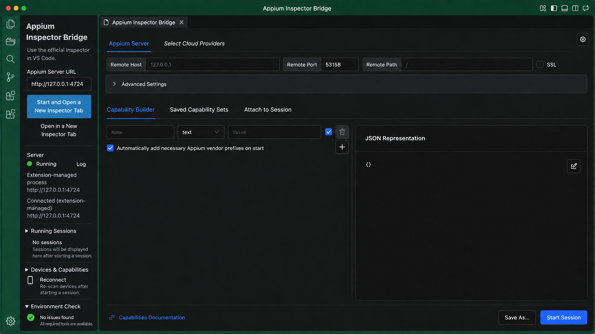

# Appium Inspector Bridge

[English README](README.md)

公式 Appium Inspector プラグインのWeb UIを、VS Codeのエディタータブ内で利用する非公式拡張です。独自のInspector実装ではなく、公式UIをそのまま利用します。

## 主な機能

- VS Code内で公式 Appium Inspector を開く
- Inspectorプラグインの導入、ローカルAppium Serverの起動・停止、ログ表示
- Appium・Inspectorプラグイン・ドライバーの起動前チェック
- 環境チェックからのAppium導入、Inspectorプラグイン導入、ドライバー導入コマンド表示
- 接続状態表示と、セッションを作り直さない再接続
- 複数の独立したInspectorタブを開き、Android／iOSセッションを並べて確認
- 起動中のAppiumセッション一覧と、選択したセッションへの新しいInspectorタブからのAttach
- Android端末とiOSシミュレーターの一覧、およびCapabilities JSONひな形生成
- Capability Sets、接続設定、テーマ、言語、保存済みジェスチャーのSecretStorage保存
- Inspector内のコピー・貼り付け、Selected Elementのコピー連携
- VS Codeの表示言語に応じた日本語・英語UI

## 必要環境

### 全プラットフォーム共通

- デスクトップ版VS Code。接続先はローカルのループバックサーバー（`localhost`、`127.0.0.1`、`::1`）のみです。Remote SSH、ブラウザー版VS Code、コンテナへの自動転送は対象外です。
- Appium 3が対応するNode.jsとnpm 10以上。Appium 3は Node.js `^20.19.0`、`^22.12.0`、または `>=24.0.0` をサポートしており、現行LTSの利用を推奨します。`node` と `npm` の両方をPATHから実行できる環境でVS Codeを起動してください。
- Appium 3、公式Inspectorプラグイン、および利用するプラットフォーム用のAppiumドライバー。

拡張機能はこれらのAppium関連コンポーネントを環境チェックで確認し、確認後に **Initial Setup / 初回セットアップ** からAppium 3と公式Inspectorプラグインを導入できます。VSIXには同梱しないため、利用中のNode.js環境との整合性を保ち、個別に更新できます。

### ワークスペースローカルのAppium

信頼済みワークスペースでは、まずアクティブなエディターが属するワークスペースフォルダーの `node_modules/.bin/appium` を探し、見つからない場合は他のワークスペースフォルダーも確認します。見つかった場合は、環境チェック・Server起動・Inspectorプラグイン導入でそのローカルAppiumを使用します。これにより、リポジトリの `package.json` でAppiumやドライバーのバージョンを管理できます。Inspectorを開く前に、パッケージマネージャーの依存関係導入を完了してください。ローカルランチャーがない場合は、従来どおりPATH上の `appium` を使用します。

### Android

- `adb` を含むAndroid SDK Platform-Tools。`adb` をPATHへ設定するか、`ANDROID_HOME` / `ANDROID_SDK_ROOT` を設定してください。
- 接続済みのAndroid端末、または起動中のAndroidエミュレーター。
- UiAutomator2ドライバー: `appium driver install uiautomator2`

### iOS

- XcodeおよびXcode Command Line Toolsを導入したmacOS。
- 利用可能なiOSシミュレーター、またはXcode開発・コード署名を設定したiOS実機。
- XCUITestドライバー: `appium driver install xcuitest`

拡張機能は `xcrun simctl` でiOSシミュレーターを一覧表示できますが、Xcode、Android SDK、端末イメージ、署名用認証情報は同梱できません。セッション開始前にこれらのプラットフォーム用ツールを導入してください。

Windowsの標準的なNode.js環境で使われる npm の `.cmd` ランチャーにも対応します。

## 使い方

1. Activity Barの **Appium Inspector** を開くか、`⌘⌥A`（Windows/Linuxは `Ctrl+Alt+A`）を押します。
2. 初回は **Initial Setup / 初回セットアップ** から公式プラグインを導入します。
3. **Start and Open Official Inspector / 起動して公式 Inspector を開く** を選ぶと、`--use-plugins=inspector` とセッション検出を有効にしてAppiumを起動し、`/inspector` をエディタータブに開きます。
4. Capabilitiesとセッションの開始・終了は公式Inspector内で操作します。

既存サーバーには **Open Running Inspector / 起動済みのInspectorを開く** で接続できます。`/wd/hub` などのbase pathを使う場合もUIは `/inspector` にあります。実際のbase pathは公式InspectorのServer Detailsに設定してください。

### 起動中セッションへのAttach

サイドバーの **Running Sessions / 起動中セッション** で **Refresh Sessions / セッション一覧を更新** を押し、対象の **Attach** を選びます。新しい公式Inspectorタブが開き、対象セッションIDを使ってAttachを開始します。古いInspectorで入力欄の自動操作に対応できない場合も、セッションIDはクリップボードへコピーされるため、公式Inspectorの **Attach to Session** タブに貼り付けて接続できます。

Appium 3ではセッション一覧の取得に `session_discovery` の有効化が必要です。拡張機能が起動するサーバーではループバック接続に限り自動で有効になります。外部から起動するローカルサーバーは `--allow-insecure=*:session_discovery` を付けて起動してください。この設定によりローカルクライアントからセッションのメタデータが見えるため、信頼できないネットワークインターフェースでは使用しないでください。

## 端末とCapabilities

**Devices & Capabilities / 端末・Capabilities** で端末一覧を更新し、端末を選ぶと `platformName`、`appium:automationName`、`appium:udid`、`appium:deviceName` を含むJSONを生成できます。公式InspectorのJSON Representationへ貼り付け、対象アプリに応じて次を追加してください。

- Android: `appium:app`、`appium:appPackage`、`appium:appActivity`
- iOS: `appium:app` または `appium:bundleId`

Androidは `adb devices -l`、iOSシミュレーターはmacOSの `xcrun simctl` を使います。この機能が端末を起動したり、アプリをインストールしたりすることはありません。

## 保存と注意点

公式Inspectorの **Save As** で保存したCapability Sets、設定、保存済みジェスチャーは、Server URLごとにVS Code SecretStorageへ保存されます。未保存の編集内容や実行中セッションは復元されません。

Server停止時には確認ダイアログを表示します。

本拡張はAppiumチームの公式製品ではありません。公式プラグインはApache-2.0、本拡張はMITライセンスです。
